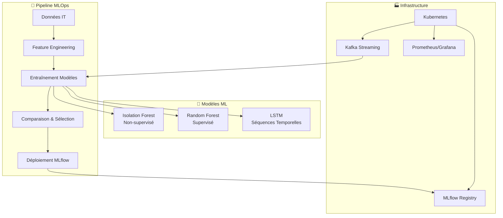

# 🚀 Pipeline MLOps/DataOps - Détection d'Anomalies IT

## 📋 Table des Matières

- [Vue d'Ensemble](#-vue-densemble)
- [Architecture](#-architecture)
- [Modèles Implémentés](#-modèles-implémentés)
- [Installation](#-installation)
- [Utilisation Rapide](#-utilisation-rapide)
- [Documentation Détaillée](#-documentation-détaillée)
- [Configuration](#-configuration)
- [Déploiement](#-déploiement)
- [Tests](#-tests)
- [Monitoring](#-monitoring)
- [Contribution](#-contribution)
- [Support](#-support)

## 🎯 Vue d'Ensemble

Cette pipeline MLOps/DataOps complète permet la **détection d'anomalies en temps réel** dans les infrastructures IT. Elle intègre des algorithmes de Machine Learning avancés avec une architecture cloud-native pour une supervision intelligente et automatisée.

### ✨ Fonctionnalités Principales

- 🤖 **3 Modèles ML** : Isolation Forest, Random Forest, LSTM
- 🔄 **Pipeline Automatisée** : Entraînement, validation, déploiement
- 📊 **Monitoring Temps Réel** : Grafana, Prometheus, MLflow
- 🐳 **Kubernetes Native** : Scalable et cloud-ready
- 🔍 **Interface CLI** : Utilisation simple et automation
- 📈 **Comparaison Automatique** : Sélection du meilleur modèle

### 🎪 Cas d'Usage

- ✅ Détection proactive d'incidents système
- ✅ Monitoring de performance des serveurs
- ✅ Analyse de logs en temps réel
- ✅ Prédiction de pannes d'infrastructure
- ✅ Optimisation des ressources IT

## 🏗️ Architecture



### 📦 Composants

| Composant | Description | Technologie |
|-----------|-------------|-------------|
| **Base Model** | Classe abstraite commune | Python OOP |
| **Isolation Forest** | Détection non-supervisée | scikit-learn |
| **Random Forest** | Classification supervisée | scikit-learn |
| **LSTM** | Analyse temporelle | TensorFlow |
| **Model Comparator** | Comparaison automatique | MLflow |
| **Main Orchestrator** | Pipeline complète | CLI + Configuration |

## 🤖 Modèles Implémentés

### 1️⃣ Isolation Forest
```python
from isolation_forest_model import IsolationForestModel

model = IsolationForestModel(contamination=0.05, n_estimators=100)
model.fit(X_train)
predictions = model.predict(X_test)
```

**📊 Caractéristiques :**
- ✅ Non-supervisé (pas besoin de labels)
- ✅ Excellent pour nouvelles anomalies
- ✅ Rapide et scalable
- ✅ Faible taux de faux positifs

### 2️⃣ Random Forest
```python
from random_forest_model import RandomForestModel

model = RandomForestModel(n_estimators=100, class_weight='balanced')
model.fit(X_train, y_train)
probabilities = model.get_anomaly_probabilities(X_test)
```

**📊 Caractéristiques :**
- ✅ Haute précision sur données étiquetées
- ✅ Importance des features
- ✅ Robuste au surapprentissage
- ✅ Gestion classes déséquilibrées

### 3️⃣ LSTM (Deep Learning)
```python
from lstm_model import LSTMModel

model = LSTMModel(sequence_length=10, lstm_units=[50, 25])
model.fit(X_train, y_train)
temporal_analysis = model.detect_temporal_anomalies(X_test)
```

**📊 Caractéristiques :**
- ✅ Analyse séquences temporelles
- ✅ Détection patterns complexes
- ✅ Prédiction d'anomalies futures
- ✅ Mémoire à long terme

## 🚀 Installation

### Prérequis

- 🐍 Python 3.8+
- 🐳 Docker & Kubernetes
- 🔧 MLflow Server
- 📊 Prometheus/Grafana (optionnel)

### Installation Rapide

```bash
# 1. Cloner le repository
git clone https://github.com/your-org/mlops-anomaly-detection.git
cd mlops-anomaly-detection

# 2. Installer les dépendances
pip install -r requirements.txt

# 3. Configuration initiale
cp config.json.example config.json

# 4. Test de l'installation
python test_complete_pipeline.py
```

### Installation avec Docker

```bash
# Build de l'image
docker build -t mlops-anomaly-detection .

# Lancement du container
docker run -p 8000:8000 -v $(pwd)/models:/app/models mlops-anomaly-detection
```

### Déploiement Kubernetes

```bash
# Déploiement complet
./deploy_mlops_pipeline.sh

# Validation du déploiement
python validate_pipeline.py
```

## 🏃 Utilisation Rapide

### 1. Entraînement Rapide

```bash
# Entraînement avec données synthétiques
python main_orchestrator.py train

# Entraînement avec vos données
python main_orchestrator.py train --data your_data.csv --deploy
```

### 2. Comparaison des Modèles

```bash
# Comparaison complète
python main_orchestrator.py compare --models all

# Comparaison sur scénarios spécifiques
python main_orchestrator.py compare --scenarios standard high_anomaly
```

### 3. Prédiction en Production

```bash
# Prédiction sur nouvelles données
python main_orchestrator.py predict --input new_data.csv --output results.csv

# Utilisation d'un modèle spécifique
python main_orchestrator.py predict --input data.csv --model random_forest
```

### 4. Interface Python

```python
from main_orchestrator import MLOpsPipeline

# Initialisation
pipeline = MLOpsPipeline()

# Pipeline complète
results = pipeline.run_full_pipeline(deploy=True)

# Prédictions
predictions = pipeline.predict_anomalies(new_data)
```

## 📚 Documentation Détaillée

### Structure des Fichiers

```
📦 mlops-anomaly-detection/
├── 📄 base_anomaly_model.py      # Classe de base abstraite
├── 🌳 isolation_forest_model.py  # Modèle Isolation Forest
├── 🌲 random_forest_model.py     # Modèle Random Forest  
├── 🧠 lstm_model.py              # Modèle LSTM
├── 🔬 model_comparison.py        # Comparaison des modèles
├── 🎯 main_orchestrator.py       # Orchestrateur principal
├── ⚙️ config.json               # Configuration
├── 🧪 test_complete_pipeline.py  # Tests complets
├── 🐳 kubernetes-manifests.yaml  # Déploiement K8s
├── 📊 grafana-dashboard.json     # Dashboard Grafana
├── 🚀 deploy_mlops_pipeline.sh   # Script de déploiement
└── 📖 README.md                  # Cette documentation
```

### Classes et Méthodes Principales

#### BaseAnomalyModel
- `generate_synthetic_data()` - Génération de données d'entraînement
- `prepare_features()` - Engineering des features
- `fit()` - Entraînement avec MLflow tracking
- `predict()` - Prédictions d'anomalies
- `evaluate()` - Évaluation des performances

#### Modèles Spécialisés
- `IsolationForestModel.find_optimal_contamination()` - Optimisation automatique
- `RandomForestModel.cross_validate()` - Validation croisée approfondie
- `LSTMModel.detect_temporal_anomalies()` - Analyse temporelle avancée

#### Pipeline Orchestrée
- `MLOpsPipeline.run_full_pipeline()` - Exécution bout en bout
- `ModelComparator.compare_models()` - Comparaison automatique

## ⚙️ Configuration

Le fichier `config.json` permet de configurer tous les aspects de la pipeline :

### Configuration des Données
```json
{
  "data": {
    "n_samples": 10000,
    "anomaly_rate": 0.05,
    "test_size": 0.2,
    "include_temporal": true
  }
}
```

### Configuration des Modèles
```json
{
  "models": {
    "isolation_forest": {
      "contamination": 0.05,
      "n_estimators": 100
    },
    "random_forest": {
      "n_estimators": 100,
      "max_depth": 15,
      "class_weight": "balanced"
    },
    "lstm": {
      "sequence_length": 10,
      "lstm_units": [50, 25],
      "epochs": 30
    }
  }
}
```

### Configuration d'Évaluation
```json
{
  "evaluation": {
    "primary_metric": "f1_score",
    "min_accuracy": 0.80,
    "min_precision": 0.75,
    "min_recall": 0.75
  }
}
```

## 🚀 Déploiement

### Déploiement Local

```bash
# 1. Démarrage des services MLflow
mlflow server --host 0.0.0.0 --port 5000

# 2. Entraînement et déploiement
python main_orchestrator.py train --deploy

# 3. Monitoring
python validate_pipeline.py
```

### Déploiement Production (Kubernetes)

```bash
# 1. Configuration des namespaces
kubectl apply -f kubernetes-manifests.yaml

# 2. Déploiement automatisé
./deploy_mlops_pipeline.sh

# 3. Vérification du statut
kubectl get pods -n mlops-pipeline
```

### Services Exposés

| Service | Port | Description |
|---------|------|-------------|
| MLflow UI | 5000 | Interface de gestion des modèles |
| Grafana | 3000 | Dashboards de monitoring |
| Prometheus | 9090 | Collecte de métriques |
| API Prédiction | 8000 | Endpoint de prédiction |

### Variables d'Environnement

```bash
export MLFLOW_TRACKING_URI="http://localhost:5000"
export KAFKA_BOOTSTRAP_SERVERS="localhost:9092"
export PROMETHEUS_GATEWAY="localhost:9091"
```

## 🧪 Tests

### Tests Unitaires

```bash
# Tests complets
python test_complete_pipeline.py

# Tests spécifiques
python -m unittest test_complete_pipeline.TestIsolationForestModel
python -m unittest test_complete_pipeline.TestRandomForestModel
python -m unittest test_complete_pipeline.TestLSTMModel
```

### Tests d'Intégration

```bash
# Test de la pipeline complète
python -m unittest test_complete_pipeline.TestMLOpsPipeline

# Test de comparaison des modèles
python -m unittest test_complete_pipeline.TestModelComparison
```

### Tests de Performance

```bash
# Tests de charge et latence
python -m unittest test_complete_pipeline.TestPerformance

# Benchmark complet
python model_comparison.py
```

### Couverture de Tests

```bash
# Installation coverage
pip install coverage

# Exécution avec couverture
coverage run test_complete_pipeline.py
coverage report -m
coverage html
```

## 📊 Monitoring

### Métriques Collectées

| Métrique | Description | Type |
|----------|-------------|------|
| `kafka_messages_processed_total` | Messages traités | Counter |
| `anomalies_detected_total` | Anomalies détectées | Counter |
| `message_processing_seconds` | Temps de traitement | Histogram |
| `model_accuracy` | Précision du modèle | Gauge |

### Dashboards Grafana

1. **Vue d'Ensemble Pipeline** - KPIs globaux
2. **Détection d'Anomalies** - Monitoring temps réel
3. **Performance Modèles** - Métriques ML
4. **Infrastructure** - État des composants

### Alertes Configurées

- 🚨 Pic d'anomalies (>5/min)
- ⚠️ Dégradation modèle (<80% précision)
- 💥 Erreurs pipeline
- 🐌 Latence élevée (>100ms)

### MLflow Tracking

- 📊 Tracking automatique des expériences
- 🏆 Comparaison des modèles
- 📦 Registry des modèles
- 🔄 Versioning automatique

## 🤝 Contribution

### Guidelines de Développement

1. **Fork** le repository
2. **Créer** une branche feature (`git checkout -b feature/amazing-feature`)
3. **Implémenter** vos changements avec tests
4. **Tester** complètement (`python test_complete_pipeline.py`)
5. **Commit** (`git commit -m 'Add amazing feature'`)
6. **Push** (`git push origin feature/amazing-feature`)
7. **Ouvrir** une Pull Request

### Standards de Code

- 🐍 **PEP 8** - Style Python
- 📝 **Docstrings** - Documentation complète
- 🧪 **Tests** - Couverture >90%
- 🔍 **Type Hints** - Annotations de types
- 📊 **Logging** - Logs structurés

### Structure des Commits

```
type(scope): description

feat(models): add LSTM temporal analysis
fix(pipeline): resolve memory leak in training
docs(readme): update installation instructions
test(lstm): add sequence preparation tests
```

## 🆘 Support

### FAQ

**Q: Comment ajouter un nouveau modèle ?**
R: Héritez de `BaseAnomalyModel` et implémentez les méthodes abstraites.

**Q: Comment configurer les alertes ?**
R: Modifiez la section `alerts` dans `config.json`.

**Q: Quelle configuration pour la production ?**
R: Utilisez `n_estimators=200+`, `epochs=50+`, validation croisée.

**Q: Comment déboguer une prédiction ?**
R: Utilisez `explain_predictions()` pour l'interprétabilité.

### Problèmes Courants

| Problème | Solution |
|----------|----------|
| MLflow non accessible | Vérifiez `MLFLOW_TRACKING_URI` |
| LSTM lent | Réduisez `sequence_length` et `epochs` |
| Mémoire insuffisante | Utilisez `batch_size` plus petit |
| Kafka timeout | Vérifiez la configuration réseau |

### Contact et Support

- 📧 **Email** : mlops-team@company.com
- 💬 **Slack** : #mlops-support
- 🐛 **Issues** : [GitHub Issues](https://github.com/your-org/mlops-anomaly-detection/issues)
- 📖 **Wiki** : [Documentation Complète](https://github.com/your-org/mlops-anomaly-detection/wiki)

---

## 📄 Licence

Ce projet est sous licence MIT. Voir le fichier [LICENSE](LICENSE) pour plus de détails.

## 🙏 Remerciements

- **Scikit-learn** pour les algorithmes ML
- **TensorFlow** pour les réseaux de neurones
- **MLflow** pour la gestion des modèles
- **Kubernetes** pour l'orchestration
- **Prometheus/Grafana** pour le monitoring

---

<div align="center">

**🎯 Mission : Transformer la supervision IT avec l'Intelligence Artificielle**

[](https://python.org)
[](https://tensorflow.org)
[](https://mlflow.org)
[](https://kubernetes.io)

*Développé avec ❤️ par l'équipe MLOps*

</div>
